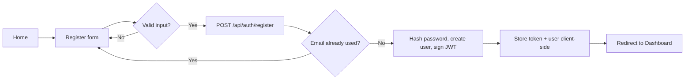
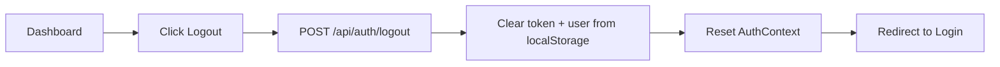

# MarioMart — Auth User Flow

This document describes how a shopper moves through registration, login,
session persistence, protected areas, and logout on MarioMart.

---

## 1. New visitor → Registration → Dashboard

1. Visitor lands on **Home** (`/`). Navbar shows **Login** and **Register**.
2. Visitor clicks **Register**, fills in name, email, password, confirm password.
3. Frontend validates locally (passwords match, min length) before calling the API.
4. `POST /api/auth/register` runs server-side validation, checks the email
   isn't already taken, hashes the password, and creates the user.
5. API returns a JWT + user object. Frontend stores both in `localStorage`
   (`mariomart_token`, `mariomart_user`) and updates `AuthContext`.
6. Visitor is redirected to **Dashboard** (`/dashboard`), now authenticated.
7. Navbar updates to show the user's name, **Dashboard** link, and **Logout**.

---

## 2. Returning user → Login → Dashboard

1. Visitor clicks **Login**, enters email and password.
2. `POST /api/auth/login` looks up the user by email, compares the password
   against the stored bcrypt hash.
3. On success, API returns a JWT + user object; frontend stores them and
   navigates to `/dashboard` (or back to whatever page originally required
   login, via the `location.state.from` redirect pattern).
4. On failure (wrong password or unknown email), API returns a generic
   `401 Invalid email or password` — the frontend shows this in a form-level
   error banner without indicating which field was wrong.

---

## 3. Session persistence (page refresh)

Since the JWT lives in `localStorage` rather than React state, a full page
reload doesn't log the user out:

1. On app load, `AuthProvider` checks `localStorage` for a token.
2. If found, it optimistically restores the cached user for an instant UI,
   then calls `GET /api/auth/me` to confirm the token is still valid.
3. If the token is valid, the confirmed user replaces the optimistic one.
4. If the token is invalid or expired, `localStorage` is cleared and the user
   is treated as logged out.

---

## 4. Accessing a protected page directly

1. Visitor (not logged in) navigates directly to `/dashboard`.
2. `ProtectedRoute` sees `isAuthenticated === false` and redirects to
   `/login`, remembering the original destination.
3. After a successful login, the user is sent back to `/dashboard`
   automatically instead of a generic landing page.

---

## 5. Logout

1. User clicks **Logout** in the Navbar.
2. Frontend calls `POST /api/auth/logout` (best-effort — logout proceeds
   even if this call fails, e.g. due to network issues).
3. Frontend clears `localStorage` and resets `AuthContext` user state to `null`.
4. User is redirected to `/login`; Navbar reverts to showing **Login** /
   **Register**.

---

## Error states surfaced to the user

| Scenario                              | Where shown        | Message style                                                  |
| ------------------------------------- | ------------------ | -------------------------------------------------------------- |
| Invalid email format / short password | Register form      | Inline error banner, from validation errors                    |
| Passwords don't match                 | Register form      | Inline error banner (client-side check)                        |
| Email already registered              | Register form      | Inline error banner ("account already exists")                 |
| Wrong email/password combo            | Login form         | Inline error banner (generic message)                          |
| Session expired mid-use               | Any protected page | Silently cleared; next protected navigation redirects to Login |

## Related documents

- `Auth-API.md` — full endpoint reference (requests, responses, status codes)
